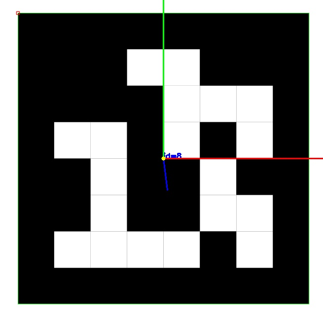
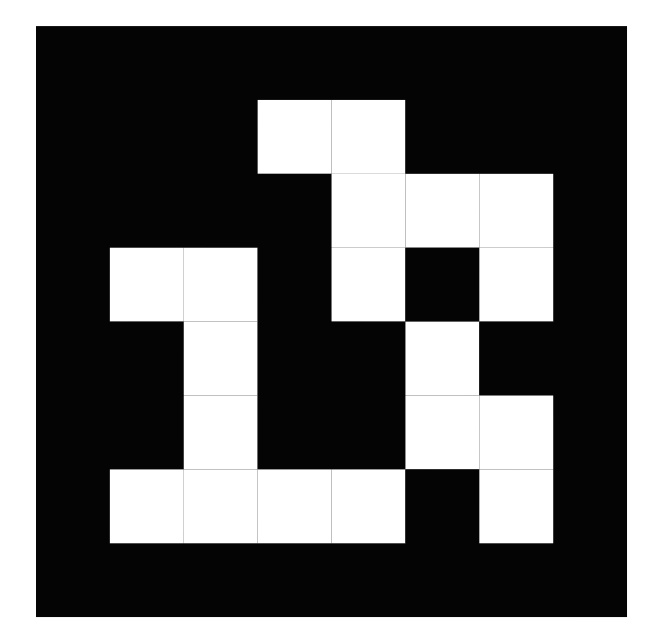
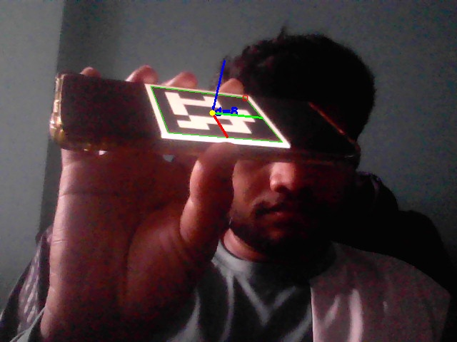
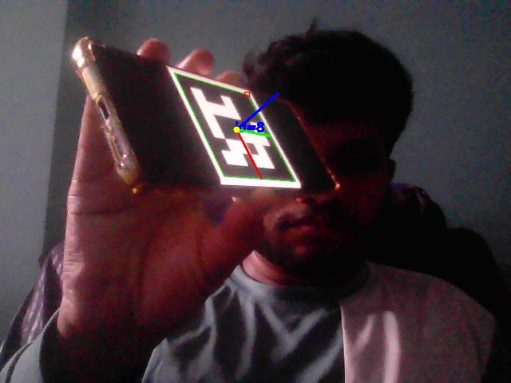
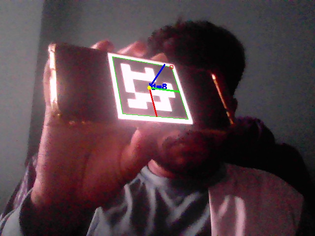

# 🧭 Object Pose Estimation Using ArUco Markers (OpenCV)

## A Beginner-Friendly Robotics Computer Vision Project

This project teaches you how robots understand the **3D position and orientation (pose)** of objects using a simple, reliable method: **ArUco markers + camera calibration + OpenCV pose estimation (solvePnP)**.

Even if you're a **total beginner**, this repo guides you step-by-step through:

- What object pose estimation means  
- Why robots need it  
- How ArUco markers work  
- How to calibrate your camera  
- How to detect markers in live video  
- How to compute 3D pose (x, y, z + rotation)  
- How to record the output as a video  
- How to debug issues  

Everything is explained clearly and practically.

---

## 📌 Why This Project Matters in Robotics

Robots cannot pick, place, move, or interact with objects unless they know:

### 1️⃣ Where is the object?  
**Position in 3D**

### 2️⃣ How is it rotated?  
**Orientation (angles / axis direction)**

This is called **6-DoF Pose Estimation** (x, y, z, roll, pitch, yaw).

ArUco markers are widely used in robotics because they are:

- easy to detect  
- robust  
- work even with normal webcams  
- ideal for beginners  

This project gives you a **fully working pose estimation pipeline**, similar to what real industrial robots use in:

- object grasping  
- visual servoing  
- pick-and-place  
- robotic navigation  
- AR applications  

---

## 🎯 Project Features

✔ Detect ArUco markers in **images or webcam video**  
✔ Estimate **3D pose** (translation + rotation)  
✔ Draw **3D axes** aligned with marker orientation  
✔ Save **annotated images**  
✔ Save **MP4 recordings** of live detection  
✔ Works with **any webcam**  
✔ Beginner-friendly explanations  
✔ Supports camera calibration  

---

# 🗂 Folder Structure

```text
object-pose-estimation-opencv/
├── detect_and_pose_aruco.py # Main script – detection + 3D pose + live view + recording
├── utils.py # Helper functions (camera loading, drawing 3D axes)
├── cam.py # Creates a synthetic camera calibration file
├── calibrate_aruco.py # (Optional) ArUco-based calibration
├── samples/
│ ├── aruco_sample.jpg # Provided sample marker image
├── outputs/ # Auto-generated outputs (created on first run)
│ ├── camera.npz # Synthetic OR real camera intrinsics
│ ├── camera_aruco.npz # Optional calibration output
│ ├── aruco_out.jpg # Annotated sample output (image mode)
│ ├── aruco_test_out.jpg
│ └── aruco_snap_*.jpg # Snapshots saved during webcam runs
├── requirements.txt # OpenCV + numpy + matplotlib
└── README.md # (THIS FILE)
```

---

# ⚙️ Installation

## 1️⃣ Install Python 3.10+
Check your version:

```bash
python --version
```

## 2️⃣ Install Dependencies

```bash
pip install -r requirements.txt
```

If ArUco gives errors, install contrib build:

```bash
pip install opencv-contrib-python
```

---

# 🎬 Usage — Step-by-Step

## ✔ Step 1 — Ensure Camera Calibration File Exists

This project uses a synthetic camera calibration file for simplicity.

Run:

```bash
python cam.py
```

This generates:

```bash
outputs/camera.npz
```

It contains:

- `K` – camera intrinsic matrix  
- `dist` – distortion coefficients  
- `reproj_err` – calibration error  

This file is **required** for accurate 3D pose estimation.

---

## ✔ Step 2 — Prepare an ArUco Marker

You can either:

### **A) Print an ArUco marker**  
(or show it on another phone/laptop screen)

OR

### **B) Use the provided sample**
```bash
samples/aruco_sample.jpg
```

Hold it in front of the webcam.

---

## ✔ Step 3 — Pose Estimation on an Image

```bash
python detect_and_pose_aruco.py --camera-file outputs/camera.npz --source samples/aruco_sample.jpg --out outputs/aruco_out.jpg
```

Output saved to:

```bash
outputs/aruco_out.jpg
```

---

## ✔ Step 4 — Live Webcam Detection (No Recording)

```bash
python detect_and_pose_aruco.py --camera-file outputs/camera.npz --source 0
```

### Controls:
- `q` → quit  
- `s` → save a snapshot to `outputs/`

---

## ✔ Step 5 — Webcam Detection + Record MP4

```bash
python detect_and_pose_aruco.py --camera-file outputs/camera.npz --source 0 --out outputs/aruco_webcam_record.mp4
```

This will:

- Show live detection  
- Draw 3D axes  
- Record MP4 video to:

```bash
outputs/aruco_webcam_record.mp4
```

---

Use this README as your final documentation for GitHub.

# 🏁 Sample Outputs

Your `outputs/` folder will look like:

```text
outputs/
├── camera.npz # Saved camera intrinsics
├── camera_aruco.npz # Optional real calibration
├── aruco_out.jpg # Annotated sample output
├── aruco_test_out.jpg
└── aruco_snap_*.jpg # Snapshots captured from webcam
```

---

## 🔬 How It Works (Simple Explanation)

1️⃣ **Detect the marker corners**  
OpenCV finds the 4 corners of each ArUco marker.

2️⃣ **Use camera calibration**  
This tells OpenCV how your camera maps 3D → 2D.

3️⃣ **Estimate 3D pose**  
OpenCV uses `solvePnP` to compute:  
- Translation (x, y, z)  
- Rotation (rvec)

4️⃣ **Draw 3D axes**  
Red = X, Green = Y, Blue = Z — shows orientation visually.

---

## 🧠 Zero-Knowledge Beginner Explanation

Imagine a robot looking at a cube. It needs to know:
- how far the cube is
- whether it's tilted
- how to grab it
- where its corners are

Your webcam = robot eye  
ArUco marker = robot "cheat code" to understand the object  
OpenCV = robot brain

This repo gives that exact capability.

---

## 🛠 Editing the Marker Size (VERY IMPORTANT)

If your printed marker side = **5 cm**, run with:
```bash
--marker-size 0.05
```

If your marker side = **10 cm**, run with:
```bash
--marker-size 0.10
```

If marker side = **20 cm**, run with:
```bash
--marker-size 0.20
```

**If marker size is wrong → the 3D pose will be wrong.**

---

## 📷 Tips for Best Results

- Use good, even lighting  
- Print marker at high quality (matte paper if possible)  
- Avoid strong reflections or gloss  
- Don’t tilt the marker too extremely (keep it visible)  
- Keep at least **20–40 cm** from webcam for standard phone/webcams  
- Use `DICT_6X6_250` for robustness:  
```bash
--dict-name DICT_6X6_250
```

---

## 🧩 Troubleshooting

- ❌ **“No markers detected”**  
- Show the printed image to the webcam (or screen)  
- Increase lighting  
- Increase marker size on screen or print larger  
- Try `DICT_6X6_250`

- ❌ **Webcam opens but nothing is shown**  
- You must show a physical marker or the sample image to the camera.

- ❌ **Recorded video file is 0 bytes or corrupt**  
- Ensure `opencv-contrib-python` installed (some builds required for video codecs):  
  ```
  pip install opencv-contrib-python
  ```

- ❌ **Pose looks wrong**  
- Verify `--marker-size` matches real marker size  
- Re-check camera calibration (`outputs/camera.npz`)

---

## 📸 Example Outputs (open these from the repo to verify)

**Annotated sample (image mode)**  


**Alternate annotated output**  


**Aruco adaptive thresh output**  


**Aruco clahe gray output**  


**Webcam snapshot(s) saved during run**  




> If any of the images above show as broken links in GitHub, run the detection once (image or webcam mode) to generate the corresponding file under `outputs/` and commit it (or replace preview images with your generated outputs).

---

## ✅ Quick reminder — common commands

Generate synthetic camera intrinsics (quick start):
```bash
python cam.py
```

Run on sample image:
```bash
python detect_and_pose_aruco.py --camera-file outputs/camera.npz --source samples/aruco_sample.jpg --out outputs/aruco_out.jpg
```

Run live webcam:
```bash
python detect_and_pose_aruco.py --camera-file outputs/camera.npz --source 0
```

Run live webcam + record:
```bash
python detect_and_pose_aruco.py --camera-file outputs/camera.npz --source 0 --out outputs/aruco_webcam_record.mp4
```

---